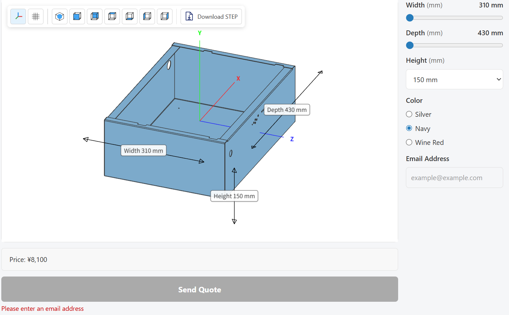

# cadrum

[](https://github.com/lzpel/cadrum/blob/main/LICENSE)
[](https://crates.io/crates/cadrum)
[](https://lzpel.github.io/cadrum)

Rust CAD library powered by [OpenCASCADE](https://dev.opencascade.org/) (OCCT 8.0.0-rc5).

<p align="center">
  
</p>

## Usage

| [primitives](#primitives) | [write read](#write-read) | [transform](#transform) | [boolean](#boolean) |
|:---:|:---:|:---:|:---:|
| [](#primitives) | [](#write-read) | [](#transform) | [](#boolean) |
| [extrude](#extrude) | [loft](#loft) | [sweep](#sweep) | [bspline](#bspline) |
| [](#extrude) | [](#loft) | [](#sweep) | [](#bspline) |

More examples with source code are available at [lzpel.github.io/cadrum](https://lzpel.github.io/cadrum).

Add this to your `Cargo.toml`:

```toml
[dependencies]
cadrum = "^0.5"
```

## Examples

#### Primitives

Primitive solids: box, cylinder, sphere, cone, torus — colored and exported as STEP + SVG.

```sh
cargo run --example 01_primitives
```

```rust
//! Primitive solids: box, cylinder, sphere, cone, torus — colored and exported as STEP + SVG.

use cadrum::Solid;
use glam::DVec3;

fn main() {
    let example_name = std::path::Path::new(file!()).file_stem().unwrap().to_str().unwrap();

    let solids = [
        Solid::cube(10.0, 20.0, 30.0)
            .color("#4a90d9"),
        Solid::cylinder(8.0, DVec3::Z, 30.0)
            .translate(DVec3::new(30.0, 0.0, 0.0))
            .color("#e67e22"),
        Solid::sphere(8.0)
            .translate(DVec3::new(60.0, 0.0, 15.0))
            .color("#2ecc71"),
        Solid::cone(8.0, 0.0, DVec3::Z, 30.0)
            .translate(DVec3::new(90.0, 0.0, 0.0))
            .color("#e74c3c"),
        Solid::torus(12.0, 4.0, DVec3::Z)
            .translate(DVec3::new(130.0, 0.0, 15.0))
            .color("#9b59b6"),
    ];

    let mut f = std::fs::File::create(format!("{example_name}.step")).expect("failed to create file");
    cadrum::write_step(&solids, &mut f).expect("failed to write STEP");

    let mut svg = std::fs::File::create(format!("{example_name}.svg")).expect("failed to create SVG file");
    cadrum::mesh(&solids, 0.5).and_then(|m| m.write_svg(DVec3::new(1.0, 1.0, 1.0), true, false, &mut svg)).expect("failed to write SVG");
}

```
- [01_primitives.step](https://lzpel.github.io/cadrum/01_primitives.step)

<p align="center">
  
</p>

#### Write read

Read and write: chain STEP, BRep text, and BRep binary round-trips with progressive rotation.

```sh
cargo run --example 02_write_read
```

```rust
//! Read and write: chain STEP, BRep text, and BRep binary round-trips with progressive rotation.

use cadrum::{Solid, Transform};
use glam::DVec3;
use std::f64::consts::FRAC_PI_8;

fn main() -> Result<(), cadrum::Error> {
    let example_name = std::path::Path::new(file!()).file_stem().unwrap().to_str().unwrap();
    let step_path = format!("{example_name}.step");
    let text_path = format!("{example_name}_text.brep");
    let brep_path = format!("{example_name}.brep");

    // 0. Original: read colored_box.step
    let manifest_dir = env!("CARGO_MANIFEST_DIR");
    let original = cadrum::read_step(
        &mut std::fs::File::open(format!("{manifest_dir}/steps/colored_box.step")).expect("open file"),
    )?;

    // 1. STEP round-trip: rotate 30° → write → read
    let a_written = original.clone().rotate_x(FRAC_PI_8);
    cadrum::write_step(&a_written, &mut std::fs::File::create(&step_path).expect("create file"))?;
    let a = cadrum::read_step(&mut std::fs::File::open(&step_path).expect("open file"))?;

    // 2. BRep text round-trip: rotate another 30° → write → read
    let b_written = a.clone().rotate_x(FRAC_PI_8);
    cadrum::write_brep_text(&b_written, &mut std::fs::File::create(&text_path).expect("create file"))?;
    let b = cadrum::read_brep_text(&mut std::fs::File::open(&text_path).expect("open file"))?;

    // 3. BRep binary round-trip: rotate another 30° → write → read
    let c_written = b.clone().rotate_x(FRAC_PI_8);
    cadrum::write_brep_binary(&c_written, &mut std::fs::File::create(&brep_path).expect("create file"))?;
    let c = cadrum::read_brep_binary(&mut std::fs::File::open(&brep_path).expect("open file"))?;

    // 4. Arrange side by side and export SVG + STL
    let [min, max] = original[0].bounding_box();
    let spacing = (max - min).length() * 1.5;
    let all: Vec<Solid> = [original, a, b, c].into_iter()
        .enumerate()
        .flat_map(|(i, solids)| solids.translate(DVec3::X * spacing * i as f64))
        .collect();

    let mut svg = std::fs::File::create(format!("{example_name}.svg")).expect("create file");
    cadrum::mesh(&all, 0.5).and_then(|m| m.write_svg(DVec3::new(1.0, 1.0, 2.0), true, false, &mut svg))?;

    let mut stl = std::fs::File::create(format!("{example_name}.stl")).expect("create file");
    cadrum::mesh(&all, 0.1).and_then(|m| m.write_stl(&mut stl))?;

    // 5. Print summary
    let stl_path = format!("{example_name}.stl");
    for (label, path) in [("STEP", &step_path), ("BRep text", &text_path), ("BRep binary", &brep_path), ("STL", &stl_path)] {
        let size = std::fs::metadata(path).map(|m| m.len()).unwrap_or(0);
        println!("{label:12} {path:30} {size:>8} bytes");
    }

    Ok(())
}

```
- [02_write_read.brep](https://lzpel.github.io/cadrum/02_write_read.brep)
- [02_write_read.step](https://lzpel.github.io/cadrum/02_write_read.step)
- [02_write_read.stl](https://lzpel.github.io/cadrum/02_write_read.stl)

<p align="center">
  
</p>
- [02_write_read_text.brep](https://lzpel.github.io/cadrum/02_write_read_text.brep)

#### Transform

Transform operations: translate, rotate, scale, and mirror applied to a cone.

```sh
cargo run --example 03_transform
```

```rust
//! Transform operations: translate, rotate, scale, and mirror applied to a cone.

use cadrum::Solid;
use glam::DVec3;
use std::f64::consts::PI;

fn main() {
    let example_name = std::path::Path::new(file!()).file_stem().unwrap().to_str().unwrap();

    let base = Solid::cone(8.0, 0.0, DVec3::Z, 20.0)
        .color("#888888");

    let solids = [
        // original — reference, no transform
        base.clone(),
        // translate — shift +20 along Z
        base.clone()
            .color("#4a90d9")
            .translate(DVec3::new(40.0, 0.0, 20.0)),
        // rotate — 90° around X axis so the cone tips toward Y
        base.clone()
            .color("#e67e22")
            .rotate_x(PI / 2.0)
            .translate(DVec3::new(80.0, 0.0, 0.0)),
        // scaled — 1.5x from its local origin
        base.clone()
            .color("#2ecc71")
            .scale(DVec3::ZERO, 1.5)
            .translate(DVec3::new(120.0, 0.0, 0.0)),
        // mirror — flip across Z=0 plane so the tip points down
        base.clone()
            .color("#e74c3c")
            .mirror(DVec3::ZERO, DVec3::Z)
            .translate(DVec3::new(160.0, 0.0, 0.0)),
    ];

    let mut f = std::fs::File::create(format!("{example_name}.step")).expect("failed to create file");
    cadrum::write_step(&solids, &mut f).expect("failed to write STEP");

    let mut svg = std::fs::File::create(format!("{example_name}.svg")).expect("failed to create SVG file");
    cadrum::mesh(&solids, 0.5).and_then(|m| m.write_svg(DVec3::new(1.0, 1.0, 1.0), true, false, &mut svg)).expect("failed to write SVG");
}

```
- [03_transform.step](https://lzpel.github.io/cadrum/03_transform.step)

<p align="center">
  
</p>

#### Boolean

Boolean operations: union, subtract, and intersect between a box and a cylinder.

```sh
cargo run --example 04_boolean
```

```rust
//! Boolean operations: union, subtract, and intersect between a box and a cylinder.

use cadrum::{Solid, Transform};
use glam::DVec3;

fn main() -> Result<(), cadrum::Error> {
    let example_name = std::path::Path::new(file!()).file_stem().unwrap().to_str().unwrap();

    let make_box = Solid::cube(20.0, 20.0, 20.0)
        .color("#4a90d9");
    let make_cyl = Solid::cylinder(8.0, DVec3::Z, 30.0)
        .translate(DVec3::new(10.0, 10.0, -5.0))
        .color("#e67e22");

    // union: merge both shapes into one — offset X=0
    let union = make_box
        .union(&[make_cyl.clone()])?;

    // subtract: box minus cylinder — offset X=40
    let subtract = make_box
        .subtract(&[make_cyl.clone()])?
        .translate(DVec3::new(40.0, 0.0, 0.0));

    // intersect: only the overlapping volume — offset X=80
    let intersect = make_box
        .intersect(&[make_cyl])?
        .translate(DVec3::new(80.0, 0.0, 0.0));

    let shapes: Vec<Solid> = [union, subtract, intersect].concat();

    let mut f = std::fs::File::create(format!("{example_name}.step")).expect("failed to create file");
    cadrum::write_step(&shapes, &mut f).expect("failed to write STEP");

    let mut svg = std::fs::File::create(format!("{example_name}.svg")).expect("failed to create SVG file");
    cadrum::mesh(&shapes, 0.5).and_then(|m| m.write_svg(DVec3::new(1.0, 1.0, 2.0), true, false, &mut svg)).expect("failed to write SVG");

    Ok(())
}

```
- [04_boolean.step](https://lzpel.github.io/cadrum/04_boolean.step)

<p align="center">
  
</p>

#### Extrude

Demo of `Solid::extrude`: push a closed 2D profile along a direction vector.

```sh
cargo run --example 05_extrude
```

```rust
//! Demo of `Solid::extrude`: push a closed 2D profile along a direction vector.
//!
//! - **Box**: square polygon extruded along Z
//! - **Oblique cylinder**: circle extruded at a steep angle
//! - **L-beam**: L-shaped polygon extruded along Z
//! - **Heart**: BSpline heart-shaped profile extruded along Z

use cadrum::{BSplineEnd, Edge, Error, Solid};
use glam::DVec3;

/// Square polygon → box (simplest extrude).
fn build_box() -> Result<Solid, Error> {
	let profile = Edge::polygon(&[
		DVec3::new(0.0, 0.0, 0.0),
		DVec3::new(5.0, 0.0, 0.0),
		DVec3::new(5.0, 5.0, 0.0),
		DVec3::new(0.0, 5.0, 0.0),
	])?;
	Solid::extrude(&profile, DVec3::new(0.0, 0.0, 8.0))
}

/// Circle extruded at a steep angle → oblique cylinder.
fn build_oblique_cylinder() -> Result<Solid, Error> {
	let profile = [Edge::circle(3.0, DVec3::Z)?];
	Solid::extrude(&profile, DVec3::new(-4.0, 6.0, 8.0))
}

/// L-shaped polygon → L-beam.
fn build_l_beam() -> Result<Solid, Error> {
	let profile = Edge::polygon(&[
		DVec3::new(0.0, 0.0, 0.0),
		DVec3::new(4.0, 0.0, 0.0),
		DVec3::new(4.0, 1.0, 0.0),
		DVec3::new(1.0, 1.0, 0.0),
		DVec3::new(1.0, 3.0, 0.0),
		DVec3::new(0.0, 3.0, 0.0),
	])?;
	Solid::extrude(&profile, DVec3::new(0.0, 0.0, 12.0))
}

/// Heart-shaped BSpline profile extruded along Z.
fn build_heart() -> Result<Solid, Error> {
	let profile = [Edge::bspline(
		&[
			DVec3::new(0.0, -4.0, 0.0),   // bottom tip
			DVec3::new(2.0, -1.5, 0.0),
			DVec3::new(4.0, 1.5, 0.0),
			DVec3::new(2.5, 3.5, 0.0),    // right lobe top
			DVec3::new(0.0, 2.0, 0.0),    // center dip
			DVec3::new(-2.5, 3.5, 0.0),   // left lobe top
			DVec3::new(-4.0, 1.5, 0.0),
			DVec3::new(-2.0, -1.5, 0.0),
		],
		BSplineEnd::Periodic,
	)?];
	Solid::extrude(&profile, DVec3::new(0.0, 0.0, 7.0))
}

fn main() -> Result<(), Error> {
	let example_name = std::path::Path::new(file!()).file_stem().unwrap().to_str().unwrap();

	let box_solid = build_box()?.color("#b0d4f1");
	let oblique = build_oblique_cylinder()?.color("#f1c8b0").translate(DVec3::new(12.0, 0.0, 0.0));
	let l_beam = build_l_beam()?.color("#b0f1c8").translate(DVec3::new(28.0, 0.0, 0.0));
	let heart = build_heart()?.color("#f1b0b0").translate(DVec3::new(38.0, 0.0, 0.0));

	let result = [box_solid, oblique, l_beam, heart];

	let step_path = format!("{example_name}.step");
	let mut f = std::fs::File::create(&step_path).expect("failed to create STEP file");
	cadrum::write_step(&result, &mut f).expect("failed to write STEP");
	println!("wrote {step_path}");

	let svg_path = format!("{example_name}.svg");
	let mut f = std::fs::File::create(&svg_path).expect("failed to create SVG file");
	cadrum::mesh(&result, 0.5).and_then(|m| m.write_svg(DVec3::new(1.0, 1.0, 1.0), true, false, &mut f)).expect("failed to write SVG");
	println!("wrote {svg_path}");

	Ok(())
}

```
- [05_extrude.step](https://lzpel.github.io/cadrum/05_extrude.step)

<p align="center">
  
</p>

#### Loft

Demo of `Solid::loft`: skin a smooth solid through cross-section wires.

```sh
cargo run --example 06_loft
```

```rust
//! Demo of `Solid::loft`: skin a smooth solid through cross-section wires.
//!
//! - **Frustum**: two circles of different radii → truncated cone (minimal loft)
//! - **Morph**: square polygon → circle (cross-section shape transition)
//! - **Tilted**: three non-parallel circular sections → twisted loft

use cadrum::{Edge, Error, Solid};
use glam::DVec3;

/// Two circles → frustum (minimal loft example).
fn build_frustum() -> Result<Solid, Error> {
	let lower = [Edge::circle(3.0, DVec3::Z)?];
	let upper = [Edge::circle(1.5, DVec3::Z)?.translate(DVec3::Z * 8.0)];
	Ok(Solid::loft(&[lower, upper])?.color("#cd853f"))
}

/// Square polygon → circle (2-section morph loft).
fn build_morph() -> Result<Solid, Error> {
	let r = 2.5;
	let square = Edge::polygon(&[
		DVec3::new(-r, -r, 0.0),
		DVec3::new(r, -r, 0.0),
		DVec3::new(r, r, 0.0),
		DVec3::new(-r, r, 0.0),
	])?;
	let circle = Edge::circle(r, DVec3::Z)?.translate(DVec3::Z * 10.0);

	Ok(Solid::loft([square.as_slice(), std::slice::from_ref(&circle)])?.color("#808000"))
}

/// Three non-parallel circular sections → twisted loft.
fn build_tilted() -> Result<Solid, Error> {
	let bottom = [Edge::circle(2.5, DVec3::Z)?];
	let mid = [Edge::circle(2.0, DVec3::new(0.3, 0.0, 1.0).normalize())?
		.translate(DVec3::new(1.0, 0.0, 5.0))];
	let top = [Edge::circle(1.5, DVec3::new(-0.2, 0.3, 1.0).normalize())?
		.translate(DVec3::new(-0.5, 1.0, 10.0))];

	Ok(Solid::loft(&[bottom, mid, top])?.color("#4682b4"))
}

fn main() -> Result<(), Error> {
	let example_name = std::path::Path::new(file!()).file_stem().unwrap().to_str().unwrap();

	let frustum = build_frustum()?;
	let morph = build_morph()?.translate(DVec3::new(10.0, 0.0, 0.0));
	let tilted = build_tilted()?.translate(DVec3::new(20.0, 0.0, 0.0));

	let result = [frustum, morph, tilted];

	let step_path = format!("{example_name}.step");
	let mut f = std::fs::File::create(&step_path).expect("failed to create STEP file");
	cadrum::write_step(&result, &mut f).expect("failed to write STEP");
	println!("wrote {step_path}");

	let svg_path = format!("{example_name}.svg");
	let mut f = std::fs::File::create(&svg_path).expect("failed to create SVG file");
	cadrum::mesh(&result, 0.5).and_then(|m| m.write_svg(DVec3::new(1.0, 1.0, 1.0), true, false, &mut f)).expect("failed to write SVG");
	println!("wrote {svg_path}");

	Ok(())
}

```
- [06_loft.step](https://lzpel.github.io/cadrum/06_loft.step)

<p align="center">
  
</p>

#### Sweep

Sweep showcase: M2 screw (helix spine) + U-shaped pipe (line+arc+line spine).

```sh
cargo run --example 07_sweep
```

```rust
//! Sweep showcase: M2 screw (helix spine) + U-shaped pipe (line+arc+line spine).
//!
//! `ProfileOrient` controls how the profile is oriented as it travels along the spine:
//!
//! - `Fixed`: profile is parallel-transported without rotating. Cross-sections
//!   stay parallel to the starting orientation. Suited for straight extrusions;
//!   on a curved spine the profile drifts off the tangent and the result breaks.
//! - `Torsion`: profile follows the spine's principal normal (raw Frenet–Serret
//!   frame). Suited for constant-curvature/torsion curves like helices and for
//!   3D free curves where the natural twist should carry into the profile.
//!   Fails near inflection points where the principal normal flips.
//! - `Up(axis)`: profile keeps `axis` as its binormal — at every point the
//!   profile is rotated around the tangent so one in-plane axis stays in the
//!   tangent–`axis` plane. Suited for roads/rails/pipes that must preserve a
//!   gravity direction. On a helix, `Up(helix_axis)` is equivalent to `Torsion`.
//!   Fails when the tangent becomes parallel to `axis`.

use cadrum::{Compound, Edge, Error, ProfileOrient, Solid, Transform};
use glam::DVec3;

// ==================== Component 1: M2 ISO screw ====================

fn build_m2_screw() -> Result<Vec<Solid>, Error> {
	let r = 1.0;
	let h_pitch = 0.4;
	let h_thread = 6.0;
	let r_head = 1.75;
	let h_head = 1.3;
	// ISO M thread fundamental triangle height: H = √3/2 · P (sharp 60° triangle).
	let r_delta = 3f64.sqrt() / 2.0 * h_pitch;

	// Helix spine at the root radius. x_ref=+X anchors the start at (r-r_delta, 0, 0).
	let helix = Edge::helix(r - r_delta, h_pitch, h_thread, DVec3::Z, DVec3::X)?;

	// Closed triangular profile in local coords (x: radial, y: along helix tangent).
	let profile = Edge::polygon(&[DVec3::new(0.0, -h_pitch / 2.0, 0.0), DVec3::new(r_delta, 0.0, 0.0), DVec3::new(0.0, h_pitch / 2.0, 0.0)])?;

	// Align profile +Z with the helix start tangent, then translate to the start point.
	let profile = profile.align_z(helix.start_tangent(), helix.start_point()).translate(helix.start_point());

	// Sweep along the helix. Up(+Z) ≡ Torsion for a helix and yields a correct thread.
	let thread = Solid::sweep(&profile, &[helix], ProfileOrient::Up(DVec3::Z))?;

	// Reconstruct the ISO 68-1 basic profile (trapezoid) from the sharp triangle:
	//   union(shaft) fills the bottom H/4 → P/4-wide flat at the root
	//   intersect(crest) trims the top H/8 → P/8-wide flat at the crest
	let shaft = Solid::cylinder(r - r_delta * 6.0 / 8.0, DVec3::Z, h_thread);
	let crest = Solid::cylinder(r - r_delta / 8.0, DVec3::Z, h_thread);
	let thread_shaft = thread.union([&shaft])?.intersect([&crest])?;

	// Stack the flat head on top.
	let head = Solid::cylinder(r_head, DVec3::Z, h_head).translate(DVec3::Z * h_thread);
	thread_shaft.union([&head])
}

// ==================== Component 2: U-shaped pipe ====================

fn build_u_pipe() -> Result<Vec<Solid>, Error> {
	let pipe_radius = 0.4;
	let leg_length = 6.0;
	let gap = 3.0;
	let bend_radius = gap / 2.0;

	// U-shaped path in the XZ plane: A↑B ⌒ C↓D
	let a = DVec3::ZERO;
	let b = DVec3::new(0.0, 0.0, leg_length);
	let arc_mid = DVec3::new(bend_radius, 0.0, leg_length + bend_radius);
	let c = DVec3::new(gap, 0.0, leg_length);
	let d = DVec3::new(gap, 0.0, 0.0);

	// Spine wire: line → semicircle → line.
	let up_leg = Edge::line(a, b)?;
	let bend = Edge::arc_3pts(b, arc_mid, c)?;
	let down_leg = Edge::line(c, d)?;

	// Circular profile in XY (normal +Z) — already aligned with the spine start tangent.
	let profile = Edge::circle(pipe_radius, DVec3::Z)?;

	// Up(+Y) fixes the binormal to the path-plane normal, avoiding Frenet
	// degeneracy on the straight segments.
	let pipe = Solid::sweep(&[profile], &[up_leg, bend, down_leg], ProfileOrient::Up(DVec3::Y))?;
	Ok(vec![pipe])
}

// ==================== main: side-by-side layout ====================

fn main() {
	let example_name = std::path::Path::new(file!()).file_stem().unwrap().to_str().unwrap();

	// Screw at origin, U-pipe offset along +X.
	let x_offset = 6.0;

	let mut all: Vec<Solid> = Vec::new();

	match build_m2_screw() {
		Ok(screw) => {
			all.extend(screw.color("red"));
			println!("✓ screw built (red, centered at origin)");
		}
		Err(e) => eprintln!("✗ screw failed: {e}"),
	}

	match build_u_pipe() {
		Ok(pipe) => {
			let placed: Vec<Solid> = pipe.translate(DVec3::X * x_offset).color("blue");
			all.extend(placed);
			println!("✓ U-pipe built (blue, offset x={x_offset})");
		}
		Err(e) => eprintln!("✗ U-pipe failed: {e}"),
	}

	if all.is_empty() {
		eprintln!("nothing to write");
		return;
	}

	let mut f = std::fs::File::create(format!("{example_name}.step")).expect("failed to create STEP file");
	cadrum::write_step(&all, &mut f).expect("failed to write STEP");
	let mut f_svg = std::fs::File::create(format!("{example_name}.svg")).expect("failed to create SVG file");
	// Helical threads have dense hidden lines that clutter the SVG; disable them.
	cadrum::mesh(&all, 0.5).and_then(|m| m.write_svg(DVec3::new(1.0, 1.0, -1.0), false, false, &mut f_svg)).expect("failed to write SVG");
	println!("wrote {example_name}.step / {example_name}.svg ({} solids)", all.len());
}

```
- [07_sweep.step](https://lzpel.github.io/cadrum/07_sweep.step)

<p align="center">
  
</p>

#### Bspline

```sh
cargo run --example 08_bspline
```

```rust
use cadrum::Solid;
use glam::{DQuat, DVec3};
use std::f64::consts::TAU;

// 2 field-period stellarator-like torus.
// `Solid::bspline` is fed a 2D control-point grid to build a periodic B-spline solid.
// Every variation below is invariant under phi → phi+π (or shifts by a multiple
// of 2π), so the resulting shape has 180° rotational symmetry around the Z axis:
//   a(phi)       = 1.8 + 0.6 * sin(2φ)      radial semi-axis
//   b(phi)       = 1.0 + 0.4 * cos(2φ)      Z semi-axis
//   psi(phi)     = 2 * phi                  cross-section twist (2 turns per loop)
//   z_shift(phi) = 1.0 * sin(2φ)            vertical undulation
const M: usize = 48; // toroidal (U) — must be even for 180° symmetry
const N: usize = 24; // poloidal (V) — arbitrary
const RING_R: f64 = 6.0;

fn point(i: usize, j: usize) -> DVec3 {
	let phi = TAU * (i as f64) / (M as f64);
	let theta = TAU * (j as f64) / (N as f64);
	let two_phi = 2.0 * phi;
	let a = 1.8 + 0.6 * two_phi.sin();
	let b = 1.0 + 0.4 * two_phi.cos();
	let psi = two_phi; // twist: 2 full turns per toroidal loop
	let z_shift = 1.0 * two_phi.sin();
	// 1. Local cross-section (pre-twist ellipse in the (X, Z) plane)
	let local_raw = DVec3::X * (a * theta.cos()) + DVec3::Z * (b * theta.sin());
	// 2. Rotate by psi around the local Y axis (major-circle tangent) — the twist
	let local_twisted = DQuat::from_axis_angle(DVec3::Y, psi) * local_raw;
	// 3. Undulate vertically in the local frame
	let local_shifted = local_twisted + DVec3::Z * z_shift;
	// 4. Push outward along the major radius by RING_R
	let translated = local_shifted + DVec3::X * RING_R;
	// 5. Rotate the whole point around the global Z axis by phi
	DQuat::from_axis_angle(DVec3::Z, phi) * translated
}

fn main() {
	let example_name = std::path::Path::new(file!()).file_stem().unwrap().to_str().unwrap();

	let grid: [[DVec3; N]; M] = std::array::from_fn(|i| std::array::from_fn(|j| point(i, j)));
	let plasma = Solid::bspline(grid, true).expect("2-period bspline torus should succeed");
	let objects = [plasma.color("cyan")];
	let mut f = std::fs::File::create(format!("{example_name}.step")).unwrap();
	cadrum::write_step(&objects, &mut f).unwrap();
	let mut f_svg = std::fs::File::create(format!("{example_name}.svg")).unwrap();
	cadrum::mesh(&objects, 0.1).and_then(|m| m.write_svg(DVec3::new(0.05, 0.05, 1.0), false, true, &mut f_svg)).unwrap();
	eprintln!("wrote {0}.step / {0}.svg", example_name);
}

```
- [08_bspline.step](https://lzpel.github.io/cadrum/08_bspline.step)

<p align="center">
  
</p>


## Requirements

- A C++17 compiler (GCC, Clang, or MSVC)
- CMake

Tested with GCC 15.2.0 (MinGW-w64) and CMake 3.31.11 on Windows.

## Build

By default, `cargo build` downloads a **prebuilt OCCT 8.0.0-rc5 binary** from GitHub Releases
matching the current target triple, and extracts it to `target/cadrum-occt-v800rc5-<triple>/`.
First-time builds finish in seconds instead of the 10–30 minutes a source build would take.

Prebuilts are published for these targets:
- `x86_64-unknown-linux-gnu` — built on manylinux_2_28 (AlmaLinux 8, glibc 2.28); works on Ubuntu 18.10+, Debian 10+, RHEL/Rocky/AlmaLinux 8+, Fedora 29+, Arch, openSUSE Leap 15.1+
- `aarch64-unknown-linux-gnu` — built on manylinux_2_28_aarch64; works on Raspberry Pi 4/5 (64-bit OS), AWS Graviton, Oracle Ampere, Apple Silicon Linux VMs
- `x86_64-pc-windows-gnu`
- `x86_64-pc-windows-msvc`

Other triples — Alpine (musl), macOS (x86_64/arm64), Windows on ARM — are not
currently published. Users on those platforms should enable the `source-build`
feature to build OCCT from upstream sources locally:

```sh
cargo build --features source-build
```

Resolution model (build.rs):

1. `OCCT_ROOT` defines the single cache location. If unset, it defaults to
   `target/cadrum-occt-v800rc5-<triple>/`. Whether explicit or default, the
   semantics are the same: if the directory already contains OCCT headers
   and libs, link directly.
2. **Cache miss** — populate the cache:
   - Without `source-build` feature (default): download the prebuilt tarball
     for `<triple>` from GitHub Release and extract into the cache dir.
     If the target is not in the supported list, `build.rs` panics with a
     pointer back here.
   - With `source-build` feature: download OCCT source from upstream and
     build with CMake into the cache dir (10–30 minutes).

To build on an unsupported triple, or to patch OCCT locally:

```sh
cargo build --features source-build
```

To pin OCCT to a persistent location across `cargo clean`:

```sh
export OCCT_ROOT=~/occt
cargo build
```

## Features

- `color` (default): Colored STEP I/O via XDE (`STEPCAFControl`). Enables `write_step_with_colors`,
  `read_step_with_colors`, and per-face color on `Solid`.
  Colors are preserved through boolean operations and other transformations.
- `source-build` (default OFF): Build OCCT from upstream sources via CMake when the cache is
  empty, instead of downloading a prebuilt tarball. Enable this if you are on a triple with no
  published prebuilt, or if you want to patch OCCT locally.

## Showcase

[Try it now →](https://katachiform.com/out/21)

<p align="center">
  <a href="https://katachiform.com/out/21"></a>
</p>

A browser-based configurator that lets you tweak dimensions of a STEP model and get an instant 3D preview and quote. cadrum powers the parametric reshaping and meshing on the backend.

## Release Notes

### 0.5.1

> 0.4.5 was published briefly but its version number was lower than the
> already-published 0.5.0 (OCCT 7.9.3, older feature set), so `cargo add
> cadrum` would silently pick up 0.5.0 instead of the newer 0.4.5 code.
> Re-released as 0.5.1 with identical contents. Prefer 0.5.1 over 0.4.5.

- **`Solid::bspline<const M, const N>(grid, periodic)`** — new constructor: build a periodic B-spline solid from a 2D control-point grid. V (cross-section) is always periodic; U (longitudinal) is controlled by the `periodic` flag (torus when `true`, capped pipe when `false`). Implemented via `GeomAPI_PointsToBSplineSurface::Interpolate` over an augmented grid plus `SetUPeriodic`/`SetVPeriodic`.
- **`write_svg` / `Mesh::to_svg` now take `shading: bool`** — opt-in Lambertian shading with head-on light. When `true`, triangles are tinted by `0.5 + 0.5 * (normal · dir)` so curved/organic shapes read clearly; `false` reproduces the pre-0.5.1 flat rendering. **Breaking vs 0.5.0**: existing callers must add the flag (pass `false` to preserve earlier output).
- **`examples/08_bspline.rs`** rewritten: 2 field-period stellarator-like torus with twisted + vertically undulating elliptic cross-sections, exercising `Solid::bspline` and `shading=true`.
- **`tests/bspline.rs`** added: verifies 180° point symmetry of the stellarator shape via XZ/YZ half-space intersection (s1 ≈ s3, s2 ≈ s4).
- **`Error::BsplineFailed(String)`** new variant. **Breaking** for downstream code that does exhaustive `match` on `Error`.
- OCCT 8.0.0 deprecation warnings resolved in `make_bspline_edge` and `make_bspline_solid` (`NCollection_HArray1<gp_Pnt>` via local `using` alias to bypass the `Handle()` macro comma-splitting issue; `NCollection_Array2<gp_Pnt>` directly).

## License

This project is licensed under the MIT License.

Compiled binaries include [OpenCASCADE Technology](https://dev.opencascade.org/) (OCCT),
which is licensed under the [LGPL 2.1](https://dev.opencascade.org/resources/licensing).
Users who distribute applications built with cadrum must comply with the LGPL 2.1 terms.
Since cadrum builds OCCT from source, end users can rebuild and relink OCCT to satisfy this requirement.
