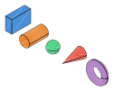
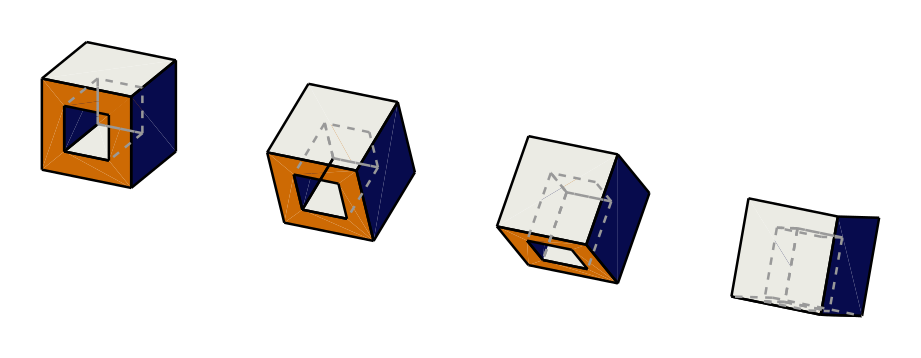
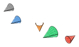
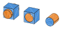

# cadrum

[](https://github.com/lzpel/cadrum/blob/main/LICENSE)
[](https://crates.io/crates/cadrum)
[](https://lzpel.github.io/cadrum)

Rust CAD library powered by [OpenCASCADE](https://dev.opencascade.org/) (OCCT 7.9.3).

<p align="center">
  
</p>

## Usage

More examples with source code are available at [lzpel.github.io/cadrum](https://lzpel.github.io/cadrum).

Add this to your `Cargo.toml`:

```toml
[dependencies]
cadrum = "^0.4"
```

Primitives: box, cylinder, sphere, cone, torus — colored and exported as STEP + SVG. ([`examples/01_primitives.rs`](examples/01_primitives.rs))

## Example <!--01-->

Primitive solids: box, cylinder, sphere, cone, torus — colored and exported as STEP + SVG.

```sh
cargo run --example 01_primitives
```

```rust
//! Primitive solids: box, cylinder, sphere, cone, torus — colored and exported as STEP + SVG.

use cadrum::Solid;
use glam::DVec3;

fn main() {
    let example_name = std::path::Path::new(file!()).file_stem().unwrap().to_str().unwrap();

    let solids = [
        Solid::cube(10.0, 20.0, 30.0)
            .color("#4a90d9"),
        Solid::cylinder(8.0, DVec3::Z, 30.0)
            .translate(DVec3::new(30.0, 0.0, 0.0))
            .color("#e67e22"),
        Solid::sphere(8.0)
            .translate(DVec3::new(60.0, 0.0, 15.0))
            .color("#2ecc71"),
        Solid::cone(8.0, 0.0, DVec3::Z, 30.0)
            .translate(DVec3::new(90.0, 0.0, 0.0))
            .color("#e74c3c"),
        Solid::torus(12.0, 4.0, DVec3::Z)
            .translate(DVec3::new(130.0, 0.0, 15.0))
            .color("#9b59b6"),
    ];

    let mut f = std::fs::File::create(format!("{example_name}.step")).expect("failed to create file");
    cadrum::io::write_step(&solids, &mut f).expect("failed to write STEP");

    let mut svg = std::fs::File::create(format!("{example_name}.svg")).expect("failed to create SVG file");
    cadrum::io::write_svg(&solids, DVec3::new(1.0, 1.0, 1.0), 0.5, true, &mut svg).expect("failed to write SVG");
}

```

<p align="center">
  
</p>

## Requirements

- A C++17 compiler (GCC, Clang, or MSVC)
- CMake

Tested with GCC 15.2.0 (MinGW-w64) and CMake 3.31.11 on Windows.

## Build

By default, `cargo build` downloads OCCT 7.9.3 source and builds it automatically.
The built library is placed in `target/occt/` and removed by `cargo clean`.

To cache the OCCT build across `cargo clean`, set `OCCT_ROOT` to a persistent directory:

```sh
export OCCT_ROOT=~/occt
cargo build
```

- If `OCCT_ROOT` is set and the directory already contains OCCT libraries, they are linked directly (no rebuild).
- If `OCCT_ROOT` is set but the directory is empty or missing, OCCT is built and installed there.
- To force a rebuild, remove the directory: `rm -rf ~/occt`

## Features

- `color` (default): Colored STEP I/O via XDE (`STEPCAFControl`). Enables `write_step_with_colors`,
  `read_step_with_colors`, and per-face color on `Solid`.
  Colors are preserved through boolean operations and other transformations.

## Other examples <!--02+-->

#### Write read

Read and write: chain STEP, BRep text, and BRep binary round-trips with progressive rotation.

```sh
cargo run --example 02_write_read
```

```rust
//! Read and write: chain STEP, BRep text, and BRep binary round-trips with progressive rotation.

use cadrum::{Solid, Transform};
use glam::DVec3;
use std::f64::consts::FRAC_PI_8;

fn main() -> Result<(), cadrum::Error> {
    let example_name = std::path::Path::new(file!()).file_stem().unwrap().to_str().unwrap();
    let step_path = format!("{example_name}.step");
    let text_path = format!("{example_name}_text.brep");
    let brep_path = format!("{example_name}.brep");

    // 0. Original: read colored_box.step
    let manifest_dir = env!("CARGO_MANIFEST_DIR");
    let original = cadrum::io::read_step(
        &mut std::fs::File::open(format!("{manifest_dir}/steps/colored_box.step")).expect("open file"),
    )?;

    // 1. STEP round-trip: rotate 30° → write → read
    let a_written = original.clone().rotate_x(FRAC_PI_8);
    cadrum::io::write_step(&a_written, &mut std::fs::File::create(&step_path).expect("create file"))?;
    let a = cadrum::io::read_step(&mut std::fs::File::open(&step_path).expect("open file"))?;

    // 2. BRep text round-trip: rotate another 30° → write → read
    let b_written = a.clone().rotate_x(FRAC_PI_8);
    cadrum::io::write_brep_text(&b_written, &mut std::fs::File::create(&text_path).expect("create file"))?;
    let b = cadrum::io::read_brep_text(&mut std::fs::File::open(&text_path).expect("open file"))?;

    // 3. BRep binary round-trip: rotate another 30° → write → read
    let c_written = b.clone().rotate_x(FRAC_PI_8);
    cadrum::io::write_brep_binary(&c_written, &mut std::fs::File::create(&brep_path).expect("create file"))?;
    let c = cadrum::io::read_brep_binary(&mut std::fs::File::open(&brep_path).expect("open file"))?;

    // 4. Arrange side by side and export SVG + STL
    let [min, max] = original[0].bounding_box();
    let spacing = (max - min).length() * 1.5;
    let all: Vec<Solid> = [original, a, b, c].into_iter()
        .enumerate()
        .flat_map(|(i, solids)| solids.translate(DVec3::X * spacing * i as f64))
        .collect();

    let mut svg = std::fs::File::create(format!("{example_name}.svg")).expect("create file");
    cadrum::io::write_svg(&all, DVec3::new(1.0, 1.0, 2.0), 0.5, true, &mut svg)?;

    let mut stl = std::fs::File::create(format!("{example_name}.stl")).expect("create file");
    cadrum::io::write_stl(&all, 0.1, &mut stl)?;

    // 5. Print summary
    let stl_path = format!("{example_name}.stl");
    for (label, path) in [("STEP", &step_path), ("BRep text", &text_path), ("BRep binary", &brep_path), ("STL", &stl_path)] {
        let size = std::fs::metadata(path).map(|m| m.len()).unwrap_or(0);
        println!("{label:12} {path:30} {size:>8} bytes");
    }

    Ok(())
}

```

<p align="center">
  
</p>

#### Transform

Transform operations: translate, rotate, scale, and mirror applied to a cone.

```sh
cargo run --example 03_transform
```

```rust
//! Transform operations: translate, rotate, scale, and mirror applied to a cone.

use cadrum::Solid;
use glam::DVec3;
use std::f64::consts::PI;

fn main() {
    let example_name = std::path::Path::new(file!()).file_stem().unwrap().to_str().unwrap();

    let base = Solid::cone(8.0, 0.0, DVec3::Z, 20.0)
        .color("#888888");

    let solids = [
        // original — reference, no transform
        base.clone(),
        // translate — shift +20 along Z
        base.clone()
            .color("#4a90d9")
            .translate(DVec3::new(40.0, 0.0, 20.0)),
        // rotate — 90° around X axis so the cone tips toward Y
        base.clone()
            .color("#e67e22")
            .rotate_x(PI / 2.0)
            .translate(DVec3::new(80.0, 0.0, 0.0)),
        // scaled — 1.5x from its local origin
        base.clone()
            .color("#2ecc71")
            .scale(DVec3::ZERO, 1.5)
            .translate(DVec3::new(120.0, 0.0, 0.0)),
        // mirror — flip across Z=0 plane so the tip points down
        base.clone()
            .color("#e74c3c")
            .mirror(DVec3::ZERO, DVec3::Z)
            .translate(DVec3::new(160.0, 0.0, 0.0)),
    ];

    let mut f = std::fs::File::create(format!("{example_name}.step")).expect("failed to create file");
    cadrum::io::write_step(&solids, &mut f).expect("failed to write STEP");

    let mut svg = std::fs::File::create(format!("{example_name}.svg")).expect("failed to create SVG file");
    cadrum::io::write_svg(&solids, DVec3::new(1.0, 1.0, 1.0), 0.5, true, &mut svg).expect("failed to write SVG");
}

```

<p align="center">
  
</p>

#### Boolean

Boolean operations: union, subtract, and intersect between a box and a cylinder.

```sh
cargo run --example 04_boolean
```

```rust
//! Boolean operations: union, subtract, and intersect between a box and a cylinder.

use cadrum::{Solid, Transform};
use glam::DVec3;

fn main() -> Result<(), cadrum::Error> {
    let example_name = std::path::Path::new(file!()).file_stem().unwrap().to_str().unwrap();

    let make_box = Solid::cube(20.0, 20.0, 20.0)
        .color("#4a90d9");
    let make_cyl = Solid::cylinder(8.0, DVec3::Z, 30.0)
        .translate(DVec3::new(10.0, 10.0, -5.0))
        .color("#e67e22");

    // union: merge both shapes into one — offset X=0
    let union = make_box.clone()
        .union(&[make_cyl.clone()])?;

    // subtract: box minus cylinder — offset X=40
    let subtract = make_box.clone()
        .subtract(&[make_cyl.clone()])?
        .translate(DVec3::new(40.0, 0.0, 0.0));

    // intersect: only the overlapping volume — offset X=80
    let intersect = make_box.clone()
        .intersect(&[make_cyl.clone()])?
        .translate(DVec3::new(80.0, 0.0, 0.0));

    let shapes: Vec<Solid> = [union, subtract, intersect].concat();

    let mut f = std::fs::File::create(format!("{example_name}.step")).expect("failed to create file");
    cadrum::io::write_step(&shapes, &mut f).expect("failed to write STEP");

    let mut svg = std::fs::File::create(format!("{example_name}.svg")).expect("failed to create SVG file");
    cadrum::io::write_svg(&shapes, DVec3::new(1.0, 1.0, 2.0), 0.5, true, &mut svg).expect("failed to write SVG");

    Ok(())
}

```

<p align="center">
  
</p>

#### Sweep

Edge construction showcase: M2 screw + U-shaped pipe.

```sh
cargo run --example 05_sweep
```

```rust
//! Edge construction showcase: M2 screw + U-shaped pipe.
//!
//! 両コンポーネントとも「Edge で spine を作って profile を sweep」する同じ
//! パターンで構築されるが、spine 構築手段が helix (ねじ) vs line+arc+line
//! (U字パイプ) で異なる。Edge API の多様性を視覚的に対比する。

use cadrum::{Edge, Error, ProfileOrient, Solid, SolidExt, Transform};
use glam::DVec3;

// ==================== Component 1: M2 ISO screw ====================

fn build_m2_screw() -> Result<Vec<Solid>, Error> {
	// iso m2 screw
	let r = 1.0;
	let h_pitch = 0.4;
	let h_thread = 6.0;
	let r_head = 1.75;
	let h_head = 1.3;
	// ISO M ねじの基本三角形高さ H = √3/2 × P (60° 等辺三角形)。
	// 山頂・谷底とも鋭利な fundamental triangle をそのまま用いる
	// (basic profile の山頂 P/8・谷底 P/4 切り詰めは省略)。これにより
	// 谷底半径 = r - r_delta、山頂半径 = r、半フランク角 = atan((P/2)/H) = 30°。
	let r_delta = 3f64.sqrt() / 2.0 * h_pitch;

	// 単一エッジのヘリックス (spine)。半径は谷底に取る。
	// x_ref=DVec3::X を渡しているので、ヘリックスは確定的に (r - r_delta, 0, 0)
	// から始まり、+Z 方向に上昇しつつ +X→+Y→-X→-Y… の順に巻いていく。
	let helix = Edge::helix(r - r_delta, h_pitch, h_thread, DVec3::Z, DVec3::X)?;

	// 閉じた三角形プロファイル (Vec<Edge> = Wire)。プロファイルはローカル座標で、
	// x が放射方向の突き出し量、y が軸方向 (= ヘリックス始点接線方向)。
	// 外側頂点の x = r_delta なので、sweep 後の山頂は半径 r ぴったりに到達する。
	// polygon は常に閉じる: 最後の点 → 最初の点が自動補完される。
	let profile = Edge::polygon([DVec3::new(0.0, -h_pitch / 2.0, 0.0), DVec3::new(r_delta, 0.0, 0.0), DVec3::new(0.0, h_pitch / 2.0, 0.0)])?;

	// プロファイルを XY 平面 (法線 Z) からヘリックス始点の接線方向に
	// 回転し、そのまま始点へ平行移動する。Vec<Edge> は Vec<T: Transform>
	// 経由で align_z / translate を持つ。
	let profile = profile.align_z(helix.start_tangent(), helix.start_point()).translate(helix.start_point());

	// ヘリックスに沿って sweep。Up(helix 軸) は helix では Torsion と等価で
	// 正しいねじ山を作る。
	let thread = Solid::sweep(&profile, &[helix], ProfileOrient::Up(DVec3::Z))?;

	// 三段構成で sharp 三角形プロファイルから ISO 68-1 basic profile (台形) を再現する:
	//   1. sweep で sharp 三角形のねじ山を生成 (主径 r、谷 r - r_delta、平坦なし)
	//   2. union(shaft) で下から H/4 を埋める → 谷底に幅 P/4 の平坦が生まれる
	//   3. intersect(crest) で上から H/8 を削る → 山頂に幅 P/8 の平坦が生まれる
	// 結果: 山頂平坦 P/8、谷底平坦 P/4、フランク全角 60°、ねじ深さ 5H/8 の
	// 厳密な ISO 基本山形。主径 = 2(r - H/8) = 2 - H/4 ≈ 1.913 mm は M2 6g
	// 主径下限 (≈ 1.913 mm) と一致するので、規格内の M2 として通る。
	let shaft = Solid::cylinder(r - r_delta * 6.0 / 8.0, DVec3::Z, h_thread);
	let crest = Solid::cylinder(r - r_delta / 8.0,       DVec3::Z, h_thread);
	let thread_shaft = thread.union([&shaft])?.intersect([&crest])?;

	// 平頭を上に重ねる。
	let head = Solid::cylinder(r_head, DVec3::Z, h_head).translate(DVec3::Z * h_thread);
	thread_shaft.union([&head])
}

// ==================== Component 2: U-shaped pipe ====================

fn build_u_pipe() -> Result<Vec<Solid>, Error> {
	// パイプ寸法
	let pipe_radius = 0.4;        // 円断面の半径
	let leg_length = 6.0;         // 直線脚の長さ (ねじの全高 ≈ 7.3 に近い値)
	let gap = 3.0;                // 両脚の間隔 = 半円の直径
	let bend_radius = gap / 2.0;  // 半円の半径

	// U 字パス in XZ 平面 (Y = 0):
	//
	//     B --arc_mid-- C
	//     |              |
	//     ↑              ↓
	//     |              |
	//     A              D
	//
	// A = (0,     0, 0)            spine 始点
	// B = (0,     0, leg_length)   第1脚の頂点
	// arc_mid = (bend_radius, 0, leg_length + bend_radius)  半円の中央点
	// C = (gap,   0, leg_length)   第2脚の頂点
	// D = (gap,   0, 0)            spine 終点
	let a = DVec3::ZERO;
	let b = DVec3::new(0.0, 0.0, leg_length);
	let arc_mid = DVec3::new(bend_radius, 0.0, leg_length + bend_radius);
	let c = DVec3::new(gap, 0.0, leg_length);
	let d = DVec3::new(gap, 0.0, 0.0);

	// 3 本のエッジで構成される spine wire: 直線 → 半円 → 直線
	let up_leg = Edge::line(a, b)?;
	let bend = Edge::arc_3pts(b, arc_mid, c)?;
	let down_leg = Edge::line(c, d)?;

	// 円プロファイル in XY 平面 (法線 +Z)。
	// 原点中心、法線 +Z は spine 始点 A = 原点、開始接線 +Z と一致するので
	// 追加の align_z / translate は恒等変換。明示せずそのまま sweep に渡す。
	let profile = Edge::circle(pipe_radius, DVec3::Z)?;

	// ProfileOrient::Up(+Y) で、U 字パスの平面 (XZ) の法線 +Y を固定 binormal に。
	// 平面内の sweep なので Frenet の特異性 (直線部分で曲率ゼロ) を回避でき、
	// 曲げ区間では円プロファイルが滑らかに追従する。
	let pipe = Solid::sweep(&[profile], &[up_leg, bend, down_leg], ProfileOrient::Up(DVec3::Y))?;
	Ok(vec![pipe])
}

// ==================== main: side-by-side layout ====================

fn main() {
	let example_name = std::path::Path::new(file!()).file_stem().unwrap().to_str().unwrap();

	// ねじ: 原点に配置 (red)
	// U字パイプ: +X 方向に offset して右側に並置 (blue)
	// ねじの最大半径 = r_head = 1.75、パイプ幅 = gap + 2*pipe_radius = 3.8
	// 間隔 ≈ 2.5 を確保するため x_offset = 6.0 とする
	let x_offset = 6.0;

	let mut all: Vec<Solid> = Vec::new();

	match build_m2_screw() {
		Ok(screw) => {
			all.extend(screw.color("red"));
			println!("✓ screw built (red, centered at origin)");
		}
		Err(e) => eprintln!("✗ screw failed: {e}"),
	}

	match build_u_pipe() {
		Ok(pipe) => {
			let placed: Vec<Solid> = pipe.translate(DVec3::X * x_offset).color("blue");
			all.extend(placed);
			println!("✓ U-pipe built (blue, offset x={x_offset})");
		}
		Err(e) => eprintln!("✗ U-pipe failed: {e}"),
	}

	if all.is_empty() {
		eprintln!("nothing to write");
		return;
	}

	let mut f = std::fs::File::create(format!("{example_name}.step")).expect("failed to create STEP file");
	cadrum::io::write_step(&all, &mut f).expect("failed to write STEP");
	let mut f_svg = std::fs::File::create(format!("{example_name}.svg")).expect("failed to create SVG file");
	// 螺旋ねじは隠線が密で SVG が読めなくなるので、hidden-line 表示を off にする。
	cadrum::io::write_svg(&all, DVec3::new(1.0, 1.0, -1.0), 0.5, false, &mut f_svg).expect("failed to write SVG");
	println!("wrote {example_name}.step / {example_name}.svg ({} solids)", all.len());
}

```

<p align="center">
  
</p>

#### Chijin

Build a chijin (hand drum from Amami Oshima) with colors, boolean ops, and SVG export.

```sh
cargo run --example 10_chijin
```

```rust
//! Build a chijin (hand drum from Amami Oshima) with colors, boolean ops, and SVG export.

use cadrum::{Face, Color, Solid, SolidExt};
use glam::DVec3;
use std::f64::consts::PI;

pub fn chijin() -> Result<Solid, cadrum::Error> {
	// ── Body (cylinder): r=15, h=8, centered at origin (z=-4..+4) ────────
	let cylinder = Solid::cylinder(15.0, DVec3::Z, 8.0)
		.translate(DVec3::new(0.0, 0.0, -4.0))
		.color("#999");

	// ── Rim: cross-section polygon in the x=0 plane, revolved 360° around Z
	let cross_section = Face::from_polygon(&[
		DVec3::new(0.0, 0.0, 5.0),
		DVec3::new(0.0, 15.0, 5.0),
		DVec3::new(0.0, 17.0, 3.0),
		DVec3::new(0.0, 15.0, 4.0),
		DVec3::new(0.0, 0.0, 4.0),
		DVec3::new(0.0, 0.0, 5.0),
	])?;
	let sheet = cross_section
		.revolve(DVec3::ZERO, DVec3::Z, 2.0 * PI)?
		.color("#fff");
	let sheets = [sheet.clone().mirror(DVec3::ZERO, DVec3::Z), sheet];

	// ── Lacing blocks: 2x8x1, rotated 60° around Z, placed at y=15 ──────
	let block_proto = Solid::cube(2.0, 8.0, 1.0)
		.translate(DVec3::new(-1.0, -4.0, -0.5))
		.rotate_z(60.0_f64.to_radians())
		.translate(DVec3::new(0.0, 15.0, 0.0));

	// ── Lacing holes: thin cylinders through each block ──────────────────
	let hole_proto = Solid::cylinder(0.7, DVec3::new(10.0, 0.0, 30.0), 30.0)
		.translate(DVec3::new(-5.0, 16.0, -15.0));

	// Distribute N blocks and holes evenly around Z, each block in a rainbow color
	// N 個のブロックと穴を Z 軸周りに等間隔配置、各ブロックに虹色を割り当て
	const N: usize = 20;
	let angle = |i: usize| 2.0 * PI * (i as f64) / (N as f64);
	let color = |i: usize| Color::from_hsv(i as f32 / N as f32, 1.0, 1.0);
	let blocks: [Solid; N] = std::array::from_fn(|i| block_proto.clone().rotate_z(angle(i)).color(color(i)));
	let holes: [Solid; N] = std::array::from_fn(|i| hole_proto.clone().rotate_z(angle(i)));
	// ── Assemble with boolean operations: union, subtract, union ─────────
	let result = [cylinder]
		.union(&sheets)?
		.subtract(&holes)?
		.union(&blocks)?;
	assert!(result.len() == 1);
	Ok(result.into_iter().next().unwrap())
}

fn main() -> Result<(), cadrum::Error> {
	let example_name = std::path::Path::new(file!()).file_stem().unwrap().to_str().unwrap();
	let result = [chijin()?];

	let step_path = format!("{example_name}.step");
	let mut f = std::fs::File::create(&step_path).expect("failed to create STEP file");
	cadrum::io::write_step(&result, &mut f).expect("failed to write STEP");
	println!("wrote {step_path}");

	let svg_path = format!("{example_name}.svg");
	let mut f = std::fs::File::create(&svg_path).expect("failed to create SVG file");
	cadrum::io::write_svg(&result, DVec3::new(1.0, 1.0, 1.0), 0.5, true, &mut f).expect("failed to write SVG");
	println!("wrote {svg_path}");

	Ok(())
}

```

<p align="center">
  
</p>

## License

This project is licensed under the MIT License.

Compiled binaries include [OpenCASCADE Technology](https://dev.opencascade.org/) (OCCT),
which is licensed under the [LGPL 2.1](https://dev.opencascade.org/resources/licensing).
Users who distribute applications built with cadrum must comply with the LGPL 2.1 terms.
Since cadrum builds OCCT from source, end users can rebuild and relink OCCT to satisfy this requirement.
