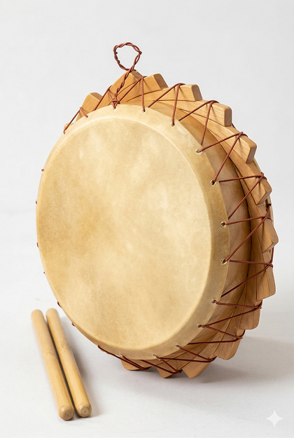

# Chijin

[](https://github.com/lzpel/chijin/blob/main/LICENSE)
[](https://crates.io/crates/chijin)

Minimal Rust bindings for [OpenCASCADE](https://dev.opencascade.org/) (OCC 7.9) — a solid modeling kernel used in CAD/CAM software.

<p align="center">
  
</p>

Provides safe, ergonomic wrappers around the OCC C++ kernel for:

- Reading/writing STEP and BRep formats (stream-based, no temp files)
- Constructing primitive shapes (box, cylinder, half-space)
- Boolean operations (union, subtract, intersect)
- Face/edge topology traversal
- Meshing with customizable tolerance
- SVG export with hidden-line removal and face colors (`color` feature)

## Name

<p align="center">
  
</p>

The library is named after the **チヂン** (*chijin*), a hand drum traditional to Amami Oshima, a subtropical island of southern Japan.
Its form — a cylindrical body bound with a ring of wooden blocks — makes for a good test of boolean operations and revolve, which is why it serves as the library's example model.
The 3D figure at the top of this page is generated entirely with chijin itself: [`examples/chijin.rs`](examples/chijin.rs).

## Usage

Add this to your `Cargo.toml`:

```toml
[dependencies]
chijin = "^0.4"
```

To try the bundled example — which builds the chijin drum and writes `out/chijin.step` and `out/chijin.svg` (the image shown at the top of this page):

```sh
cargo run --example chijin --features bundled,color
```

## Features

- `bundled` (default): Download and build OCCT 7.9.3 from source during `cargo build`.
  The built library is installed into `target/occt/` inside the crate directory.
- `prebuilt`: Use a pre-built OCCT pointed to by the `OCCT_ROOT` environment variable.
  `OCCT_ROOT` can be any directory that contains OCCT headers and static libraries —
  including the `target/occt/` generated by a previous `bundled` build.

  ```toml
  # Cargo.toml
  chijin = { version = "0.2", features = ["prebuilt"], default-features = false }
  ```

  ```sh
  # Shell (point to the bundled build output, or any other OCCT installation)
  export OCCT_ROOT=/path/to/occt
  cargo build
  ```

- `color`: Colored STEP I/O via XDE (`STEPCAFControl`). Enables `write_step_with_colors`,
  `read_step_with_colors`, and per-face color on `Solid`.

## License

This project is licensed under the MIT License.
